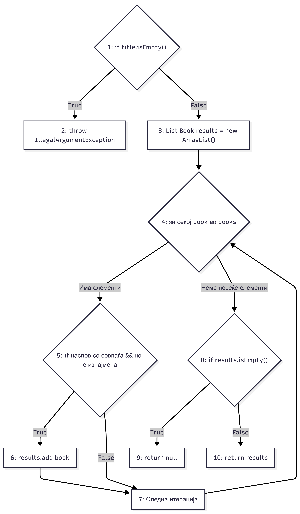
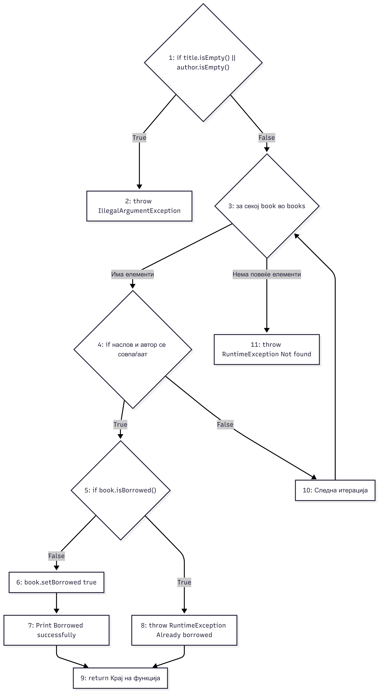

# SI_2026_lab2_223063
# Лабораториска вежба 2 по Софтверско инженерство

**Име:** Афродита Јованова  
**Индекс:** 223063

## 2. Control Flow Graphs

### Граф за функцијата `searchBookByTitle`

### Граф за функцијата `borrowBook`

## 3. Цикломатска комплексност

Цикломатската комплексност на функциите е пресметана со помош на формулата:
**V(G) = P + 1**
каде што **P** е бројот на условни јазли. Притоа, сложените услови се разложуваат на нивните прости компоненти.

### Пресметка за `searchBookByTitle`
Во оваа функција ги имаме следниве предикатни јазли:
1. `if (title.isEmpty())` (1 прост услов)
2. `for (Book book : books)` (1 услов за итерација)
3. `if (book.getTitle().equalsIgnoreCase(title) && !book.isBorrowed())` (2 прости услови поврзани со &&)
4. `if (results.isEmpty())` (1 прост услов)

* **Вкупно предикати (P):** 1 + 1 + 2 + 1 = 5  
* **Цикломатска комплексност:** V(G) = 5 + 1 = **6**

### Пресметка за `borrowBook`
Во оваа функција ги имаме следниве предикатни јазли:
1. `if (title.isEmpty() || author.isEmpty())` (2 прости услови поврзани со ||)
2. `for (Book book : books)` (1 услов за итерација)
3. `if (book.getTitle().equalsIgnoreCase(title) && book.getAuthor().equalsIgnoreCase(author))` (2 прости услови поврзани со &&)
4. `if (book.isBorrowed())` (1 прост услов)

* **Вкупно предикати (P):** 2 + 1 + 2 + 1 = 6  
* **Цикломатска комплексност:** V(G) = 6 + 1 = **7**

---

## 5 & 6. Тест случаи според Every Statement критериумот за `searchBookByTitle`

За да се исполни **Every Statement** критериумот, потребно е да избереме тест случаи кои ќе ги извршат сите линии код во функцијата барем еднаш. За оваа функција се потребни **минимално 3 тест случаи**.

### Табела на тест случаи и покриеност на наредби

| Тест случај | Влез (`title`) | Очекуван излез | Покриени линии / јазли од кодот | Објаснување |
| :--- | :--- | :--- | :--- | :--- |
| **TC1** | `""` (празен наслов) | `IllegalArgumentException` | Почетен услов за грешка | Веднаш влегува во првиот `if` и ја извршува линијата со `throw`. |
| **TC2** | `"Clean Code"` | Листа со 1 елемент | Главно тело, циклус и враќање листа | Го скока `if`, влегува во циклусот, ја наоѓа книгата, ја додава во листата и ја враќа. |
| **TC3** | `"Non Existing Book"`| `null` | Циклус и краен `if` услов | Поминува низ циклусот без резултат. Листата е празна, па влегува во `if (results.isEmpty())` и враќа `null`. |

---

## 7 & 8. Тест случаи според Every Branch критериумот за `borrowBook`

За да се исполни **Every Branch** критериумот, потребно е да ги поминеме сите можни гранки (True и False исходи од сите одлуки) во графот. За оваа функција се потребни **минимално 4 тест случаи**.

### Табела на тест случаи и покриеност на гранки

| Тест случај | Влез (`title`, `author`) | Состојба во библиотека | Очекуван излез | Покриени гранки |
| :--- | :--- | :--- | :--- | :--- |
| **TC1** | `"", "Robert C. Martin"` | Било каква | `IllegalArgumentException` | True гранка на почетниот услов за валидација. |
| **TC2** | `"Non Existing", "Unknown"`| Празна / Без таа книга | `RuntimeException` ("Not found") | False гранка од циклусот (книгата не е пронајдена). |
| **TC3** | `"Clean Code", "Robert C. Martin"`| Книгата е слободна | Успешно изнајмување | False гранка кај проверката `if (book.isBorrowed())`. |
| **TC4** | `"Clean Code", "Robert C. Martin"`| Книгата е веќе изнајмена| `RuntimeException` ("Already borrowed") | True гранка кај проверката `if (book.isBorrowed())`. |

---

## 9 & 10. Тест случаи според Multiple Condition критериумот

За овој критериум треба да ги провериме сите можни комбинации на вистинитост за сложените булови изрази преку short-circuit евалуација.

### А) За условот во `searchBookByTitle`: `if (book.getTitle().equalsIgnoreCase(title) && !book.isBorrowed())`
Потребни се **минимално 3 тест случаи** поради логичкото `&&`:

* **TC1 (True && True):** Влез `"Java"`, книгата не е изнајмена. Двата подуслови се точни, книгата се додава во резултати.
* **TC2 (True && False):** Влез `"Java"`, но книгата е веќе изнајмена. Првиот услов е точен, вториот е неточен, условот паѓа.
* **TC3 (False && X):** Влез `"Python"`. Насловот не се совпаѓа (False), па поради `&&` вториот услов воопшто не се ни проверува.

### Б) За условот во `borrowBook`: `if (title.isEmpty() || author.isEmpty())`
Потребни се **минимално 3 тест случаи** поради логичкото `||`:

* **TC1 (True || X):** Влез `""`, `"Author"`. Бидејќи насловот е празен (True), веднаш се фрла исклучок без да се проверува авторот.
* **TC2 (False || True):** Влез `"Title"`, `""`. Насловот не е празен (False), но авторот е празен (True), па се фрла исклучок.
* **TC3 (False || False):** Влез `"Title"`, `"Author"`. Двата подуслови се неточни, условот се прескокнува и се продолжува кон позајмување на книгата.